<div align="center">

# Spitify

**Music, podcasts and audiobooks for Android and iPhone.**
Play your own files, find online music, stream it, or download it for offline listening. Listen on your phone or through your car’s playback controls. No Spitify account. Recommendations are learned on your device.

Android: Kotlin · Jetpack Compose · Media3 &nbsp; | &nbsp; iPhone: SwiftUI · AVFoundation · iOS 17+

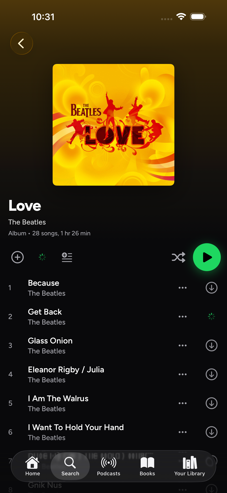 &nbsp; 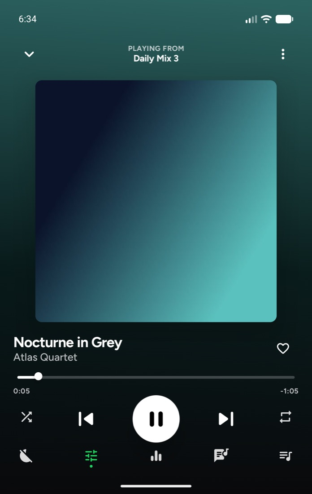

</div>

---

## Choose your device

| Platform | What is available | Install and build |
|---|---|---|
| **Android 11+** | Phones, tablets and foldables; Android Auto and car playback controls | [APK releases](../../releases) · [Android build steps](#build) |
| **iPhone, iOS 17+** | Native SwiftUI app; Files import, Siri shortcuts, background audio and lock-screen controls | [IPA releases](../../releases) · [SideStore, AltStore and Xcode setup](ios/README.md) |
| **Desktop** | macOS (Apple silicon and Intel), Windows 10/11 and Linux; the same app with a wide layout, keyboard shortcuts and media keys | [Desktop installers](../../releases) · [Desktop details](#desktop) |
| **CarPlay** | System Now Playing controls; a separate Spitify browsing interface is included in the source and needs Apple-approved CarPlay signing | [CarPlay details](#carplay-and-siri) |

## Screenshots

### iPhone

| Full player | Album page | Small player |
|:---:|:---:|:---:|
| 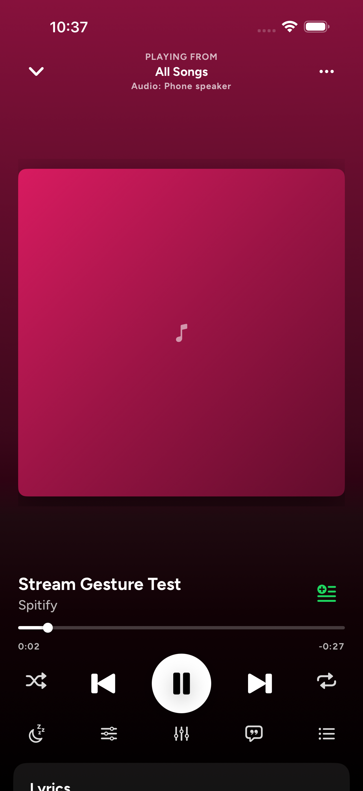 |  | 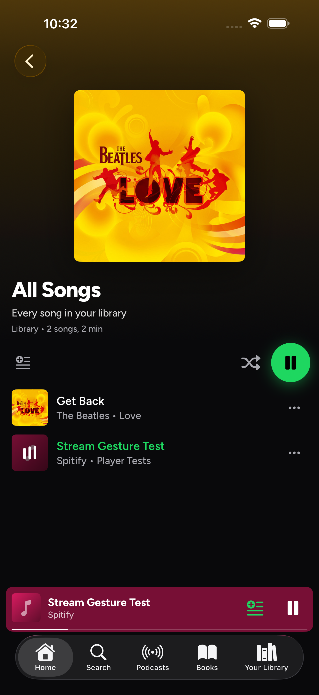 |

<sub>Current iPhone simulator captures. Player screens use a generated test song; the album page shows an online search result.</sub>

### Android

| Cover screen | Player | Made for you | daylist |
|:---:|:---:|:---:|:---:|
| 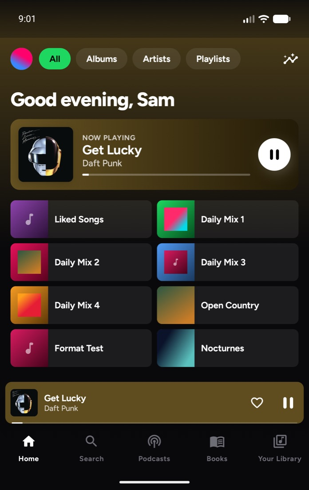 |  | 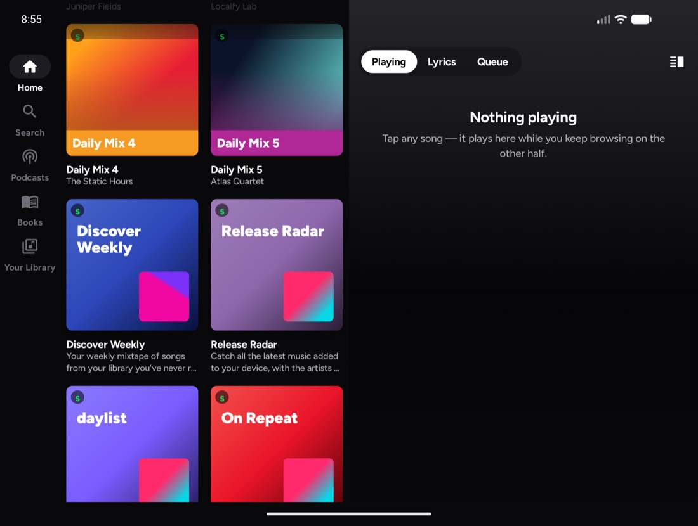 | 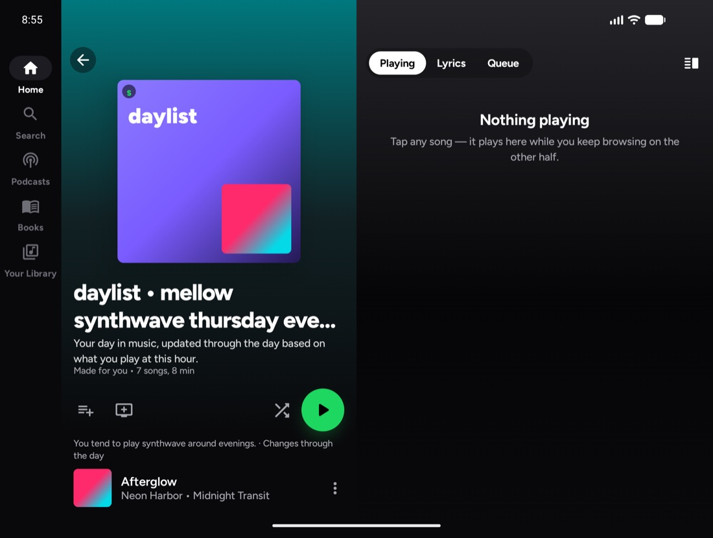 |

| Dual-screen player with synced lyrics | Flex Mode (half-folded) |
|:---:|:---:|
| 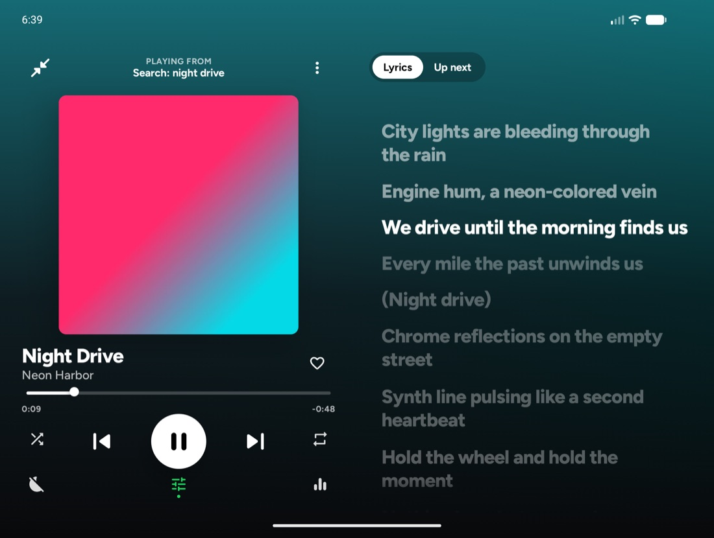 | 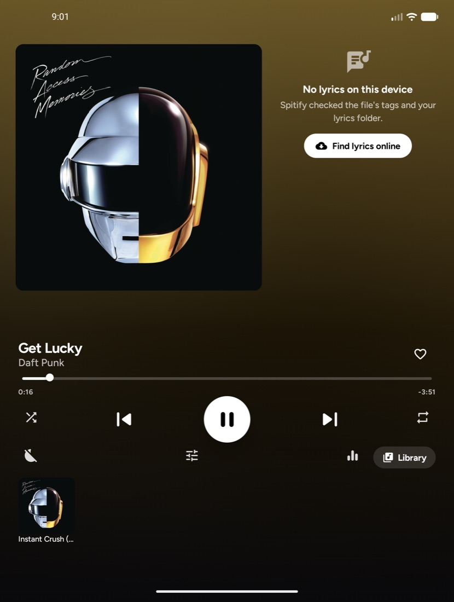 |

| 10-band equaliser | Audiobooks | Edit metadata | Profile | First-run setup |
|:---:|:---:|:---:|:---:|:---:|
| 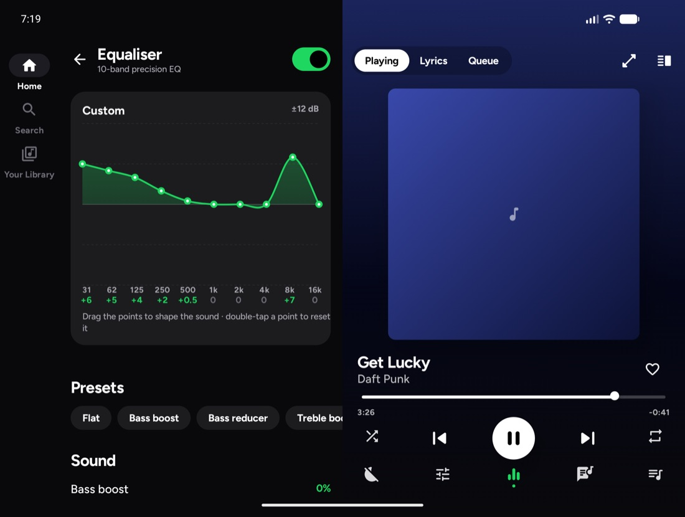 | 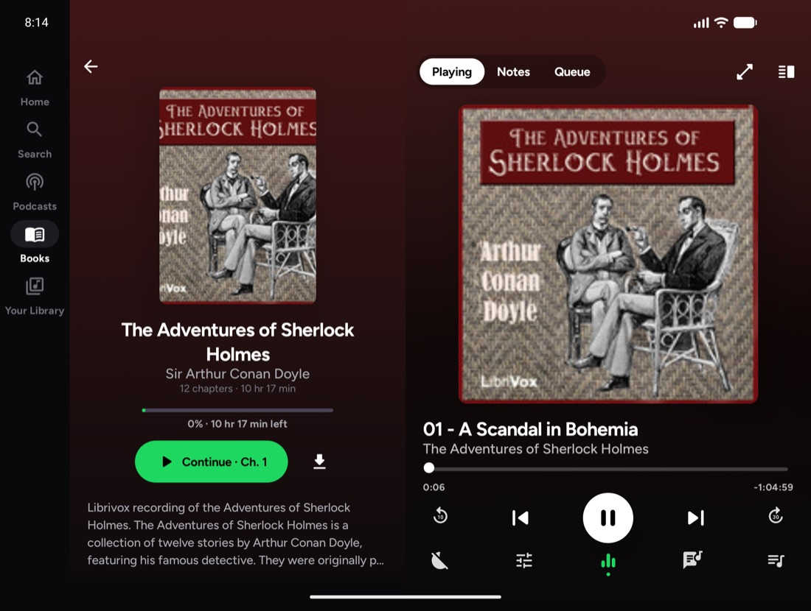 | 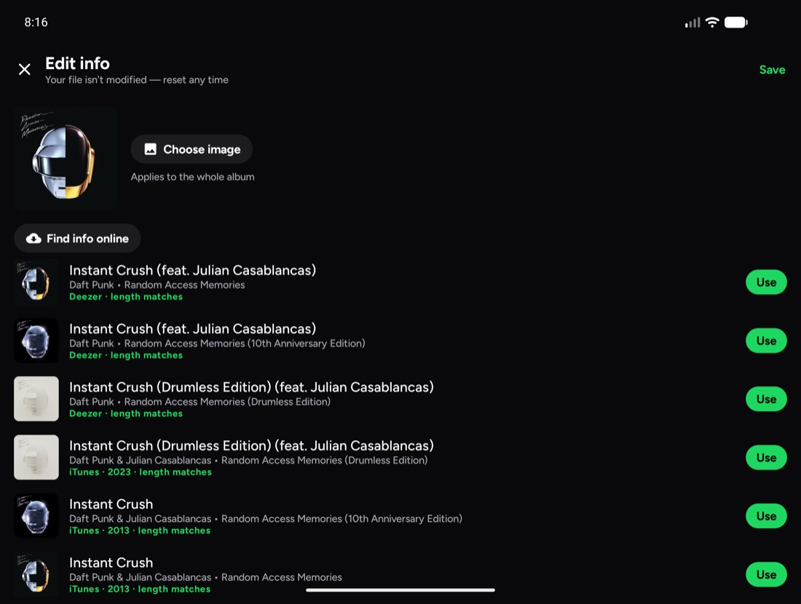 | 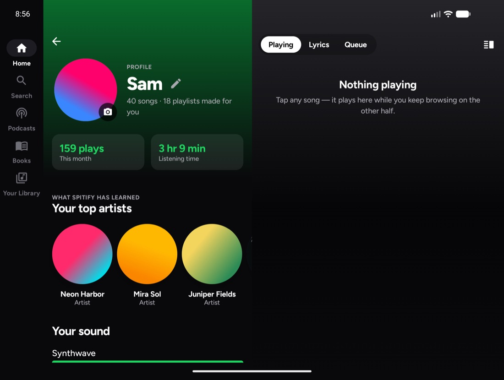 | 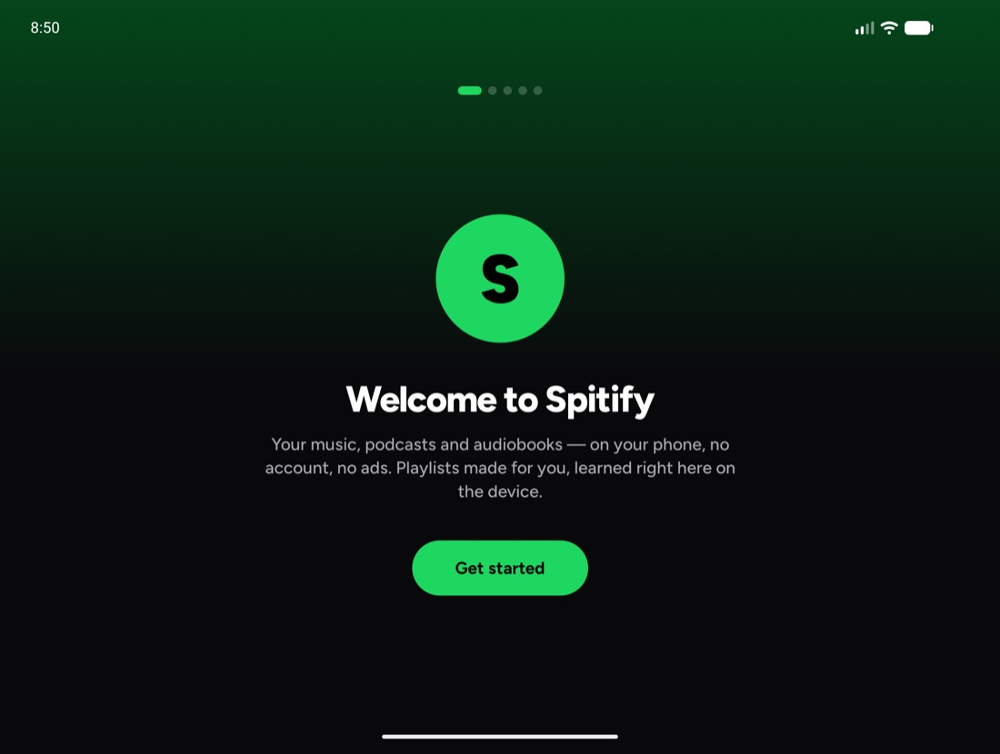 |

<sub>Screenshots are from the Galaxy Z Fold8 emulator profile included in this repo, using generated test music.</sub>

## Features

### 🎵 Your music, Spotify-style
- Home with quick picks, generated playlists, Jump back in, Recently added and top artists.
- One search list ranks songs, albums, artists, playlists, podcasts, episodes and audiobooks together. Each result shows its type and creator, with an **E** badge when the source marks it explicit.
- Online results are ready to play, even before saving them. **Play** streams online audio as it arrives. **Add to Library** saves the song without downloading it. **Download** keeps an offline copy with song details and cover art.
- Temporary listening audio has a separate 1 GB cache. Older audio is removed first; Settings can clear it without touching downloads. See [streaming and saved music](docs/STREAMING.md).
- Downloads include Wi-Fi-only mode, cancellation, retries, and matched backup sources when the first source fails. Online availability varies. See [music sources and checks](docs/MONOCHROME.md).
- Download rings keep their last known progress while files are checked and saved. Album counts include completed files immediately.
- Your Library with filters, sorting, and grid or list view.
- Album, artist, playlist, podcast and book pages share headers coloured from their cover art, title spacing and a round Play button. Song rows, page titles and forms follow the same theme throughout the app.
- Liked Songs, playlists, and a queue you can reorder by dragging.
- **Keep music playing** is on by default. Fresh suggestions follow your queue, while manual picks, repeat, sleep timers and clearing the queue take priority.
- Shuffle that reorders the real queue, so "Next up" shows what will actually play.
- Sleep timer with fade-out, playback speed, skip silence, gapless playback, and 0–12 s **crossfade**.
- **Synced lyrics** from file tags, `.lrc` files, or [LRCLIB](https://lrclib.net), fetched automatically when you're online. They follow playback and you can tap a line to jump to it.
- Lock-screen and Bluetooth playback controls. On iPhone, song details follow the current queue and supported iOS versions can show expanded album artwork.
- Swipe down over the full player to collapse it to the small player. Android also supports notification controls and resume-on-reboot; swiping it away from Recents stops playback.

### Friends, playlists and listening together
- Use **Your Library → Add from Spotify** to paste a public playlist link, preview its cover and songs, then save it. Regular links and Spotify short share links work. You can also find public playlists in Search. Matching runs in the background when you open or save a playlist, and saved matches are reused. Playback starts with the first available song while the rest prepare. Spitify keeps the playlist name, cover, description and source link, then matches songs to its own files and online sources. Incomplete source lists are labelled. Unmatched songs move into **Failed matches** at the bottom. Import a matching local file to restore its original place, or tap **Choose copy**. Chosen copies and failed matches stay saved. Missing catalogue songs can also use the same matched backup sources as playback.
- Use **Scan Spotify code** in Search or the Library menu to choose a photo or take a picture. The code is read on your phone; only its number goes to Spotify to find the item. Playlist codes open a playlist preview. Other supported codes open the matching Spotify link and a search in Spitify. Keep the bars level, clear and fully visible. This lookup uses Spotify’s unofficial web-player service and can stop working if that service changes.
- Open **Friends** in the sidebar or Library. Tap a person to view their name, photo and shared music. Your profile updates itself while sharing is on; choose **Profile → Public profile** or keep it private to people you follow. Use **My code** at the top of Friends to share an image, or **Add friend** to import one. Adding a friend turns sharing on. Unfollowing sits in a separate menu and asks first.
- Share a song, album or playlist from its menu. Invite editors to add, remove, rename and reorder songs. Their changes wait for the owner's app to accept them.
- **Shared Mix** takes turns between songs picked by each person and skips repeated recordings. It uses contributions you choose, rather than uploading listening history.
- **Rooms** lets a host approve guests, share a queue, and choose whether guests can control playback. Everyone plays their own matching source. Leaving or ending a Room stops future Room updates from restarting a guest's music.
- Artists opened from **Your Library** show your saved music. Their menu lets you change the cover or hide the artist without deleting songs. **Settings → Hidden artists** brings them back. Main artist tags help keep featured guests out of the main artist list, while full song credits stay visible. Library sort choices stay saved.
- Online artist pages show songs from their albums and singles, with **Show more songs** to keep browsing beyond the popular picks. Follow artists from their pages, then open **New releases** in Your Library. Checks run when you open the app or refresh the feed. Optional notifications alert you to new releases found during those checks.

Friends and Rooms use public relays, with no Spitify-run server. Delivery and source availability can vary. See [sharing, privacy and limits](docs/SOCIAL.md).

### Playlists and complete albums

Open a saved playlist and choose **Edit playlist** to change its artwork, rename it, or delete it. Deletion asks first and keeps the songs in your library. Adding songs shows which playlist received them. Chosen covers appear in Home, Library, Search and widgets, and are included in device backup.

Search lists **Saved album** and **Online album** separately. Album search results have a native download button beside them. It fetches the complete album and queues only missing songs; you do not have to open another page first. The album page uses the same download icon. Online artist pages show progress, possible name matches, and a retry when a request fails.

### Home screen widgets and backup

iPhone has **Now Playing** with cover art and previous/play-pause/next controls, plus **Playlists**, **Albums**, **Most Played**, **Recently Played**, **Recently Added**, **Liked Songs**, and **Friends** widgets in three sizes. Music shelves show your covers and play an item when tapped. Keep the widget extension when installing through SideStore. Release checks require both the extension and its artwork-sharing permission. Android has the same music shelves, plus a **Now Playing** widget with cover art and previous/play-pause/next buttons. Playback controls and music tiles work without opening the app. The **Friends** widget opens your friends, code or listening rooms. Hold an empty Home Screen space, choose Widgets and find Spitify. Existing Quick Play and Your Library widgets update to Now Playing and Playlists.

Settings, chosen covers, saved matches and friend details use the phone’s own backup system. Android restores depend on its backup service and the same app signing key; folder access may need to be granted again. iPhone settings belong to the device backup, and the friend key can travel in encrypted device backups. **Offload App** keeps iPhone app data; **Delete App** followed by a plain reinstall does not restore all settings automatically. There is no Spitify backup account.

### Downloads
Every song row shows whether it plays offline: a green mark for songs on the phone (your own files and finished downloads), or a download button on streamed songs, which becomes a progress ring you can tap to cancel. Albums, playlists, mixes and All Songs have a **Download all** button that turns into a check once everything is offline. Search results have download buttons too.

### Problem reports
**Settings → Send problem report** shares errors the app recovered from. On Android it also includes where the app was stuck whenever the screen stopped responding, which is the quickest way to trace lag.

All Songs can sort by title, artist, album, recently added, or most played. Tap the accent-coloured audio output at the bottom of the player to choose a device.

### ✨ Made for you, learned on the device
Every listen is logged locally: how much you heard, whether you finished or skipped it, and the time of day. A taste model rebuilds from that log as you listen:
- **What it weighs:** recent listening counts more, finished songs count more than skips, and liked songs count extra.
- **What it learns:** which songs and artists you play together, and what you play at each time of day.

It generates the playlists you'd expect:

| Made for you | Your mixes | Throwbacks |
|---|---|---|
| Discover Weekly · Release Radar · **daylist** ("mellow synthwave thursday evening") | This Is *artist* · *artist* Radio · Chill / Energy / Focus · genre mixes | On Repeat · Repeat Rewind · Your Top Songs *year* · decade mixes |

There's also song radio on any song, artist radio on artist pages, and **Don't recommend** for songs or artists. Each playlist has a generated cover and a line explaining why it was made. The same listening rules run locally in Kotlin on Android and Swift on iPhone. Making these recommendations needs no network calls or AI service.

### Car playback

#### CarPlay and Siri

The iPhone app sends the current song, cover, playback position and play/pause/skip controls to Apple’s Now Playing screen. It keeps using the same queue when you move between the phone, Bluetooth and the car.

- **Siri and Shortcuts:** play a named song, album, artist, playlist or followed show from your library, with online artist and song lookup when no local match exists; pause, resume, skip, go back, shuffle or change repeat. These actions also appear in Apple’s Shortcuts app. If Siri hears Spotify, try adding ‘player’ to the command, or use **Settings › Siri & Shortcuts** to give a shortcut a distinct name such as ‘Pocket music.’ Siri's built-in music requests also have a handler, which needs a Siri-enabled signing profile.
- **CarPlay browsing:** the included interface has For you, Library, Podcasts and Books, plus Now Playing and the queue. Shuffle and repeat use the phone’s player.
- **Signing limit:** the dedicated Spitify CarPlay icon and browsing screens require Apple’s approved CarPlay audio permission in the signing profile. The normal SideStore build leaves that permission off. The car’s system Now Playing controls do not depend on that separate browsing interface.

See [iPhone voice and car setup](ios/README.md#voice-and-car-playback). Siri’s choice of app and car hardware behaviour still need checking on the actual phone and vehicle.

#### Android Auto

The Android app supports Android Auto, Android Automotive, Assistant and Bluetooth playback controls.

- Browse For you, Library, Podcasts and Books.
- Choose a song to queue its album or playlist from that point.
- Search by voice, with commands such as “Play Daft Punk on Spitify.”
- Use Like and Shuffle for music, or −10 / +30 seconds for spoken word.
- See the current song’s artwork in the car.

For the release APK, Android Auto may hide Spitify until you allow sideloaded media apps. Open Android Auto settings, tap **Version and permission info** ten times to enable developer mode, then open **Developer settings → Unknown sources**. Reconnect the car and check **Customize launcher**. Open Spitify once and grant music access first. These steps are also in **Spitify Settings → Android Auto**. See [Google's testing guide](https://developer.android.com/training/cars/testing). Car hardware still needs testing separately.

### 🎙️ Podcasts & 📚 audiobooks
- **Podcasts:** search Apple's directory or paste any RSS feed. Stream or download episodes. Each one keeps its resume position and played state. Podcasts have their own speed setting and −10 / +30 s skips.
- **Free audiobooks:** 20,000+ public-domain [LibriVox](https://librivox.org) books, streamed or downloaded chapter by chapter.
- **Your own audiobooks:** files in an `Audiobooks` folder or `.m4b` files show up on the Books tab. Each book shows "Chapter X of Y · time left" and continues where you stopped.

### 🏷️ Metadata & artwork
- Your Library lists the main artists of your saved music. Each song keeps its full guest credits, with separate artist pages available from those credits. A guest-only credit does not add a main Library artist or borrow the main artist’s album cover.
- **Auto-fix:** untagged songs are matched on Deezer or iTunes, and books on Open Library. A match is only accepted when the length matches within 3 s.
- **Missing covers:** fetched automatically.
- **Manual editing:** edit any song, album or book, with online suggestions or your own image.
- Android manual edits stay in the app. On iPhone, automatic fill can write missing tags and artwork into local files; Music app library files stay read-only. Downloads include tags and cover art.

### 🔊 Formats & sound
Both apps have a 10-band equaliser. On iPhone, EQ and crossfade apply to local files and downloads; live music streams use the system player.

**Normalize volume** is on by default. It measures decoded audio and lowers loud recordings without boosting quiet ones or raising your device volume. Format detection reads the actual audio bytes, even when a source supplies the wrong filename or format label.

| Platform | Audio formats |
|---|---|
| iPhone | FLAC, ALAC, AAC/M4A, MP3, WAV, AIFF and CAF through iOS decoders; Ogg/Opus verified on iOS 26.4, with support on older iOS versions depending on their decoders |
| Android | The formats below, with extra decoders bundled in the app |

The following details describe Android. See [the iPhone guide](ios/README.md) for its format limits.

- **Formats:** MP3, AAC/M4A, **ALAC**, **FLAC** (incl. 24-bit/96 kHz), Opus, Vorbis, WAV, **AIFF/AIFF-C**, AC-3/E-AC-3, DTS, TrueHD, AMR and more. Bundled FFmpeg decoders cover what the phone can't, and Spitify adds its own AIFF reader.
- **Unsupported:** WMA, APE, WavPack and DSD files are shown greyed out.
- **Equaliser:** an in-app **10-band** EQ with a curve you drag directly, 15 presets, bass boost, surround, loudness and a limiter.

### 🎨 Make it yours
- **25 art themes:** Cats & kittens, Minecraft, Outer space, Black card, Floral, Nautical, Stellar & lunar, Canadian, European Union, Woodland, Desert, Arctic, Autumn, Rainy day, Sakura, Cyberpunk, Arcade, Candy shop, Coffeehouse, Reading room, Coral reef, Volcano, Lavender, Sunset and Steampunk. Each has custom pixel art, matching colours and quiet edge details. Browse them in **Settings → Appearance → Art themes**. Turn the art and borders off while keeping the colours. The original simple and kids' looks remain available.
- **App icons:** 25 vinyl-record designs, including attitude labels, pictures and kids' choices.
- **Theme:** Dark, Light, AMOLED or follow the system.
- **Accent colour:** presets or the current album art on both apps; Android also offers Material You.
- **Look and feel:** typefaces, text sizes, artwork shape, and player style: artwork, spinning vinyl or minimal. Font choices differ by platform.
- **Room for longer text:** Home, Search, library lists and player controls adapt to narrow screens and larger text. Selected colours stay readable in light and dark themes.
- **Player style button:** change artwork style from the button beside the song title. Your choice stays set for music. Podcasts and audiobooks always show their cover, then your music style returns when you switch back. Vinyl keeps its scratch gesture and uses the cover as a textured paper label.
- **Motion:** reduce motion and haptics toggles.
- **Profile:** one place for your photo, name, bio, privacy and shared music. New photos save at 1536 pixels; friends receive a sharper copy.

## iPhone

The iPhone app in [`ios/`](ios/) is built with SwiftUI and runs on iOS 17+. It includes online search, streaming, offline downloads, playlists, on-device mixes, synced lyrics, podcasts, audiobooks and song-detail editing.

- Import audio with the Files app, AirDrop, the share sheet, or Finder file sharing. Spitify’s Music and Audiobooks folders appear under **On My iPhone → Spitify**.
- Optionally include downloaded, DRM-free songs from the Music app library. Apple Music subscription tracks cannot be played through this option.
- Keep listening in the background. Use the lock screen, Bluetooth, Siri shortcuts and car playback controls.
- Swipe down over the full player to return to the bottom rail.
- See album art on the lock screen. Supported iOS versions can show expanded portrait artwork; iOS controls when that view appears.
- Fill missing song details and covers, edit them manually, and use a name and photo for your local profile.

See [the iPhone guide](ios/README.md) for formats, installation, building, Siri and CarPlay signing.

## Android phones, tablets and foldables

The Android app works on regular phones and tablets as well as foldables. Its wider layouts can show the library and player side by side. The repo includes Galaxy Z Fold8 emulator profiles for checking hinge and cover-screen behaviour.

| Device layout | What you get |
|---|---|
| Phone or closed foldable | Full-screen pages and a small player that opens into the full player |
| Wide screen or open foldable | Library beside an always-on player, with Playing, Lyrics and Queue |
| Dual-screen player | Artwork on one half, synced lyrics or the queue on the other |
| Half-folded Flex Mode | Artwork and lyrics above the hinge, controls below it |
| Fold or unfold mid-song | Playback, scroll position and queue carry over |

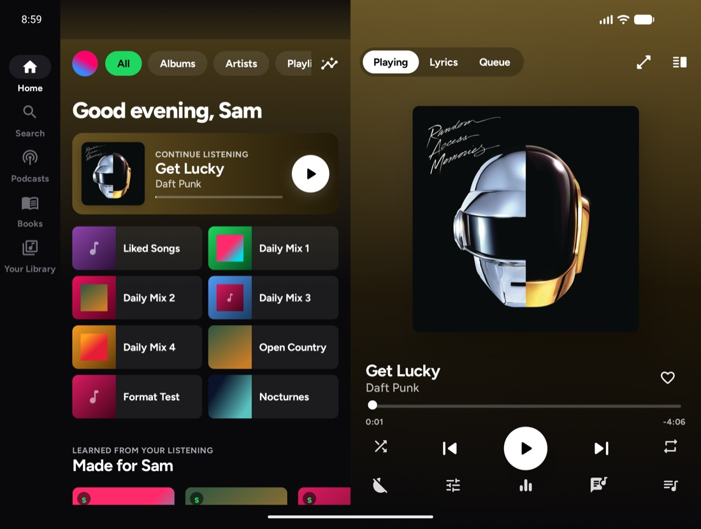

## Desktop

Spitify Desktop is the same app for computers, built with Kotlin and Compose Multiplatform, so it shares the phone app's code and looks the same. It plays your own music folders, streams and downloads songs, and includes podcasts, audiobooks, lyrics, Made for you mixes, Friends and Listening Rooms.

- **Your music folders:** Spitify watches your Music folder and any others you add in Settings, and picks up new files on its own. You can also drag files or folders onto the window.
- **Playback:** FFmpeg plays MP3, AAC, FLAC, ALAC, Opus, Ogg, WAV, AIFF and more, with gapless playback, crossfade, normalisation and the 10-band equaliser.
- **Media controls:** media keys work everywhere. Now Playing shows in Control Center on macOS and through MPRIS on Linux. Windows doesn't show Spitify in its media overlay yet.
- **Wide layout:** the library sits beside a Now Playing pane with Playing, Lyrics and Queue tabs, and ⤢ opens a full-window player.
- **Keyboard and mouse:**
  - Space plays or pauses; ← and → seek.
  - Cmd/Ctrl+← and → change track; Cmd/Ctrl+F searches; Cmd/Ctrl+L opens lyrics; Esc goes back.
  - Right-click a song for its menu.
- **Downloads:** saved as AAC 256 kbps `.m4a` in `Music/Spitify`. You can change the folder in Settings.

| | Where Spitify keeps its data |
|---|---|
| macOS | `~/Library/Application Support/Spitify` |
| Windows | `%APPDATA%\Spitify` |
| Linux | `~/.local/share/spitify` |

## Install

**Android:** download the APK from [Releases](../../releases) and open it on your phone, or install with:

```bash
adb install -r app-release.apk
```

**iPhone:** download the unsigned IPA from [Releases](../../releases) and sign/install it with SideStore or AltStore. You can also add the [Spitify SideStore source](https://raw.githubusercontent.com/calebtrueman/spitify/main/ios/sidestore-source.json) to receive release updates. See the [iPhone setup and build guide](ios/README.md). An unsigned IPA cannot be installed by opening it directly.

**Desktop:** download the installer for your computer from [Releases](../../releases):

| Computer | File |
|---|---|
| Mac with Apple silicon | `Spitify-Desktop-<version>-macOS-arm64.dmg` |
| Intel Mac | `Spitify-Desktop-<version>-macOS-x64.dmg` |
| Windows | `Spitify-Desktop-<version>-Windows-x64.msi` |
| Linux | `.deb` (Debian, Ubuntu) or `.rpm` (Fedora, openSUSE) |

The installers aren't signed. On a Mac, open Spitify once (macOS will refuse), then go to **System Settings › Privacy & Security** and click **Open Anyway** (needed once). On Windows, choose **More info › Run anyway** if SmartScreen warns.

On a Fold, set **Settings › Display › Screen continuity** to *Always* for Spitify, so it keeps playing on the cover screen when you close the phone.

## Build

These commands build **Android**. For the iPhone app, use [the Xcode steps](ios/README.md#build).

Requirements: JDK 17, the Android SDK (platform 37), NDK 26.1 and CMake 3.22. Gradle downloads everything else.

```bash
./gradlew assembleRelease        # app/build/outputs/apk/release/app-release.apk
./gradlew testDebugUnitTest      # unit tests (taste engine, lyrics, feeds, library)
./gradlew connectedDebugAndroidTest   # Android Auto browse test (needs a device/emulator)
```

The release build is signed with the debug key so it can be sideloaded. Add your own signing config before distributing.

FFmpeg ships as prebuilt static libraries (an LGPL build, without GPL or non-free parts). To rebuild them from source, run `scripts/build-ffmpeg.sh`.

**Desktop:**

```bash
./gradlew :desktop:run                 # run from source
./gradlew :desktop:test :core:test     # desktop and shared-code tests
./gradlew :desktop:packageReleaseDmg   # or packageReleaseMsi / packageReleaseDeb / packageReleaseRpm
```

Each installer bundles its own Java runtime and the FFmpeg build for that system, so build each one on the system it's for. GitHub Actions builds all of them for every release (`.github/workflows/desktop.yml`).

Toolchain: AGP 9.4 · Gradle 9.6 · Kotlin 2.3 · compileSdk/targetSdk 37 · minSdk 30.

## Galaxy Z Fold8 emulator

Samsung doesn't publish One UI emulator images. Instead, `scripts/setup-emulator.sh` creates Android 17 dual-display foldable AVDs with the exact **Fold8** and **Fold8 Ultra** panel resolutions, a working hinge sensor, and the fold at the correct position.

```bash
scripts/setup-emulator.sh                       # creates both AVDs, boots Galaxy_Z_Fold8
scripts/setup-emulator.sh Galaxy_Z_Fold8_Ultra
scripts/make-test-music.sh                      # optional: tagged test library (needs ffmpeg)

adb emu fold / adb emu unfold                   # cover screen / main screen
adb emu sensor set hinge-angle0 100             # half-open (rotate 90° first for Flex Mode)
```

## Project layout

```
app/src/main/java/com/localfy/app/      (internal package name predates the rename)
├─ data/          MediaStore scanner, Room database, library repository
│  ├─ taste/      listening history → taste model → generated playlists, profile
│  ├─ meta/       metadata overrides, auto-fix, custom artwork
│  ├─ art/        online album art
│  ├─ podcast/    podcast & audiobook feeds, downloads, resume
│  └─ lyrics/     tag reader (ID3/FLAC/Ogg/MP4), LRC parser, LRCLIB
├─ playback/      MediaLibraryService (Android Auto), crossfade, 10-band EQ, AIFF extractor
└─ ui/            adaptive fold-aware shell, player, screens, theme
core/             Kotlin shared by Android and desktop (models, mixes, catalogue, social, taste)
desktop/          Spitify Desktop: Compose Multiplatform UI, FFmpeg (JavaCPP) playback, media keys
ios/Spitify/      SwiftUI iPhone app, AVFoundation player, Siri shortcuts and CarPlay screens
ios/SpitifyTests/ iPhone unit and native playback checks
ffmpeg/           Media3 FFmpeg audio decoder module (JNI + prebuilt FFmpeg 6.0)
scripts/          emulator setup, test music, FFmpeg build
```

## Privacy

Your library, listening history and taste profile stay on the phone. Friends sends only the profile and music details you choose to share. Public profiles and playlists are public; direct shares are encrypted. Relays can still see the sending and receiving public keys. Spitify goes online when a feature needs it. Music search sends your query to Monochrome. Playing or downloading online music contacts the audio source; backup matching can send song, artist and album details to a public source. Streaming writes temporary audio to the listening cache. Permanent music downloads start when you request them. Other optional lookups can be switched off in Settings:

| Feature | Service |
|---|---|
| Online music search, streaming and downloads | Monochrome Tracks; matched public backup sources, including Internet Archive |
| Public Spotify playlist search and metadata | wolfXspotify public service; Spotify public embed as a fallback |
| Friends and Rooms, when enabled | Public Nostr relays; editable in Friends |
| Missing album art and song info | Deezer, iTunes Search |
| Missing book info and covers | Open Library |
| Synced lyrics | LRCLIB |
| Podcast search | Apple Podcasts directory + the show's RSS feed |
| Free audiobooks | LibriVox via the Internet Archive |

## License

Spitify's own code is [MIT](LICENSE). Bundled components keep their own licenses (FFmpeg LGPL 2.1, AndroidX Media3 Apache 2.0, fonts OFL 1.1); see [THIRD_PARTY_NOTICES.md](THIRD_PARTY_NOTICES.md).

Spitify is a personal project. It is not affiliated with, endorsed by, or connected to Spotify AB or Samsung.
